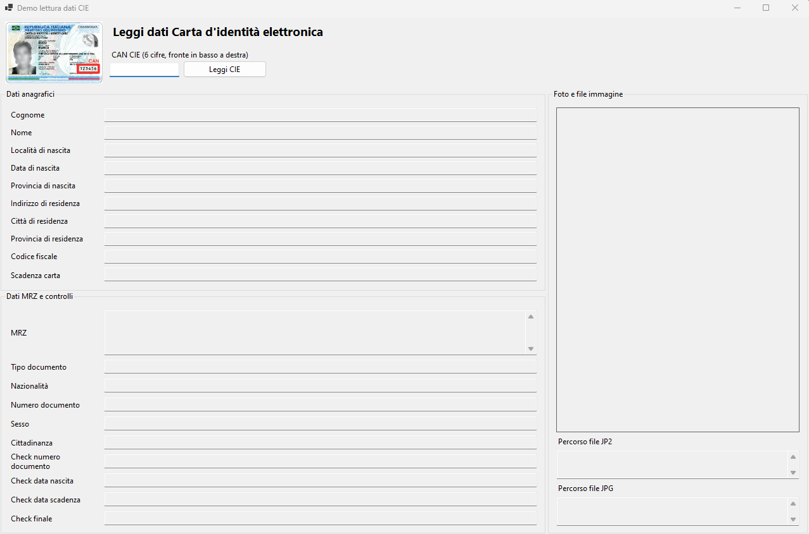
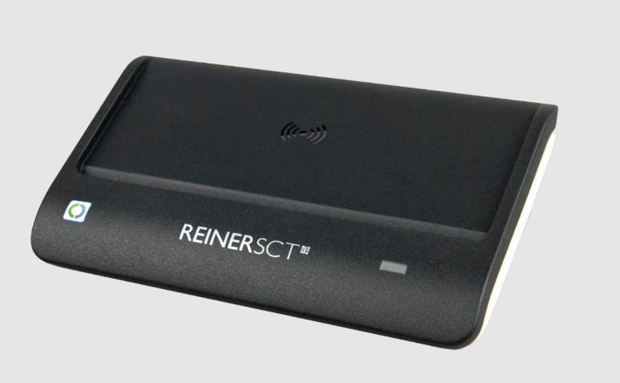

# CIE Reader

Applicazione .NET per leggere una **Carta d'Identità Elettronica (CIE)** tramite lettore smart card compatibile, estrarre i dati principali, decodificare la **MRZ**, salvare la foto della carta e visualizzare tutto sia da **console** sia da **WinForms**.

Screenshot:



## Contenuto della soluzione

La soluzione contiene due progetti principali:

* **CieReader**: libreria / applicazione con la logica di lettura della CIE, parsing JSON, parsing MRZ e salvataggio immagini.
* **DemoDatiCIE**: applicazione WinForms per leggere e visualizzare i dati della CIE in una UI desktop.

## Funzionalità

* lettura dati anagrafici dalla CIE
* acquisizione MRZ
* decodifica dei campi MRZ
* verifica dei check digit MRZ
* estrazione della foto della carta in formato **JP2**
* conversione della foto in **JPG**
* visualizzazione dati in interfaccia WinForms
* validazione del **CAN** (6 cifre)

## Requisiti

* **Windows**
* **.NET 9**
* **Visual Studio 2022**
* lettore smart card compatibile PC/SC
* librerie / SDK necessarie per la lettura della CIE

## Lettore consigliato

Per la lettura della CIE è consigliato un lettore smart card compatibile PC/SC. Un modello consigliato e testato per questo tipo di utilizzo è:

* **cyberJack RFID basis**
* Pagina prodotto: [https://www.reiner-sct.com/en/produkt/cyberjack-rfid-basis/](https://www.reiner-sct.com/en/produkt/cyberjack-rfid-basis/)

Immagine del lettore:



## Dipendenze principali

A seconda della configurazione del progetto, vengono usate queste librerie:

* `PCSC`
* `CIE.MRTD.SDK`
* `CSJ2K`
* `Nancy`
* `Magick.NET-Q8-x64` oppure `Magick.NET-Q8-x86`

### Nota sulle dipendenze

`CSJ2K` e `Nancy` **non sono residui da rimuovere**: vengono usati internamente da `CIE.MRTD.SDK`.

Per la conversione dell'immagine JP2 in JPG è consigliato usare un pacchetto **Magick.NET** specifico per piattaforma:

* `Magick.NET-Q8-x64` per build x64
* `Magick.NET-Q8-x86` per build x86

Questo evita di portarsi dietro runtime non necessari.

## Struttura logica

### `DatiCie`

Classe principale che incapsula la lettura completa della carta:

* legge il JSON restituito dal reader
* estrae i campi principali
* decodifica la MRZ tramite `MrzData`
* salva la foto in `.jp2`
* converte la foto in `.jpg`
* espone i path dei file generati

Uso tipico:

```csharp
DatiCie dati = DatiCie.ReadCie(can);
```

### `MrzData`

Classe dedicata alla gestione della MRZ:

* parsing delle righe MRZ
* estrazione dei campi
* verifica dei check digit
* normalizzazione dei dati

### `Reader`

Classe che dialoga con il lettore smart card e restituisce il contenuto della CIE in formato JSON.

## CAN della CIE

Per leggere la carta è richiesto il **CAN** (*Card Access Number*), cioè il codice di **6 cifre** stampato sul fronte della CIE, normalmente in basso a destra.

Il progetto valida il CAN prima di tentare la lettura.

## Output immagine

La foto viene salvata in due formati:

* **JP2**: formato originale letto dalla carta
* **JPG**: conversione più comoda per apertura e visualizzazione

I file vengono salvati, di default, nella cartella dell'eseguibile.

## Avvio del progetto WinForms

Il progetto `DemoDatiCIE` consente di:

* inserire il CAN
* leggere la carta
* visualizzare i dati anagrafici
* visualizzare i dati MRZ
* vedere l'esito dei check digit
* visualizzare la foto JPG
* consultare i path dei file immagine generati

## Configurazione consigliata piattaforma

È consigliato configurare la soluzione con build separate:

* **x64**
* **x86**

ed evitare `Any CPU` quando si usa `Magick.NET`, così da avere output più pulito e prevedibile.

## Come eseguire

### Console / libreria

1. collegare il lettore smart card
2. inserire la CIE
3. eseguire il progetto
4. inserire il CAN richiesto

### WinForms

1. impostare `DemoDatiCIE` come progetto di avvio
2. avviare l'applicazione
3. inserire il CAN
4. premere **Leggi CIE**

## Note importanti

* la conversione da JP2 a JPG dipende dal corretto caricamento di `Magick.NET`
* il file JP2 originale conviene mantenerlo per conservare il dato sorgente della carta

## Possibili miglioramenti futuri

* esportazione dati in PDF
* storico letture
* salvataggio su database
* gestione foto senza passare dal file system
* controllo visuale dei check digit con colori
* supporto a maschere multiple WinForms

## Licenza

BSD 3-Clause License

## Autore

Progetto sviluppato e adattato per esigenze di lettura e visualizzazione dati CIE in ambiente .NET / WinForms da Emilie Rollandin - Studio Archistico

